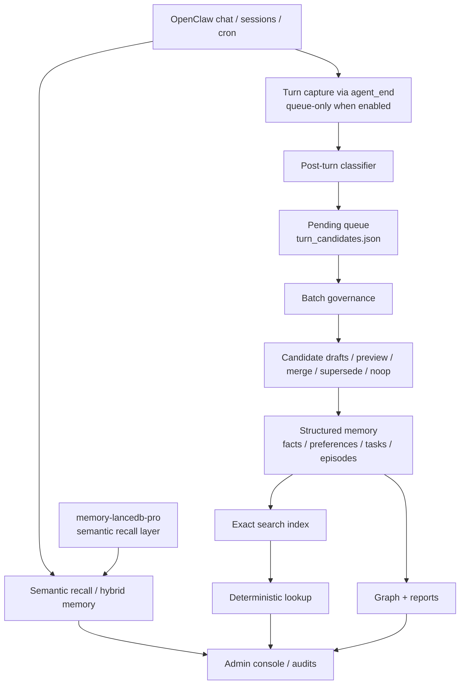

# Claw Memory System

English | [简体中文](README.zh-CN.md)

Local-first hybrid memory system for OpenClaw.

## v0.1 autonomous memory runtime
- Structured layers: facts / preferences / tasks / episodes
- Pending turn queue: `turn_candidates.json`
- Rule-based post-turn classifier
- Queue-only autonomous lifecycle wiring (default off)
- Batch governance that can absorb safe drafts automatically
- Dedupe / merge / supersede / noop
- Fresh-workspace smoke path passes

## Architecture at a glance


## Capability matrix
| Capability | Purpose | Default | Dependency | Status |
|---|---|---:|---|---|
| Structured memory layers | Store stable facts, preferences, tasks, episodes | On | None | Ready |
| Pending turn queue | Buffer new memory candidates safely | On | None | Ready |
| Queue-only lifecycle capture | Capture turns without direct structured writes | Off | None | Ready |
| Batch governance | Absorb safe drafts and refresh graph/reports | On | None | Ready |
| Exact search | Deterministic lookup over indexed memory | Optional build | None | Ready |
| Semantic recall | Higher-quality recall across phrasing variants | External | `memory-lancedb-pro` | Recommended companion |
| Dedupe / noop / merge | Prevent noisy re-writes and duplicate intake | On | None | Ready |
| Fresh workspace smoke | Validate bootstrap → queue → governance flow | Manual/CI | None | Ready |

## Safe defaults
- `autoTurnCapture = false`
- `autoTurnQueueOnly = true`
- `turnCaptureMinConfidence = 0.88`
- `batchGovernanceEnabled = true`
- `batchGovernanceEvery = 6h`

Default principle:

> queue first, govern second, absorb third.

The system does **not** directly write every captured turn into structured memory by default.

## Required companion dependency for full functionality
For full semantic recall, install and enable **`memory-lancedb-pro`** alongside this plugin.

Recommended tested stack for `v0.1.1`:
- `openclaw >= 2026.3.12`
- `claw-memory-system = 0.1.1`
- `memory-lancedb-pro >= 1.1.0-beta.8`

Recommended install path:
```bash
openclaw plugins install memory-lancedb-pro
openclaw plugins enable memory-lancedb-pro
```

If the current environment does not expose `memory-lancedb-pro` via the default plugin source, install it from its repository source instead, then enable it:

```bash
openclaw plugins install https://github.com/CortexReach/memory-lancedb-pro
openclaw plugins enable memory-lancedb-pro
```

Without `memory-lancedb-pro`, this project still provides structured memory, queueing, governance, and exact search, but semantic recall quality will be significantly reduced.

## Quickstart
### Minimal path
1. Install and enable `memory-lancedb-pro`
2. Install and enable this plugin
3. If your OpenClaw environment uses explicit plugin allowlists, add both plugins to `plugins.allow`
4. Run bootstrap
5. Enable or keep the batch governance cron

### Recommended commands
```bash
openclaw plugins install memory-lancedb-pro
openclaw plugins enable memory-lancedb-pro
openclaw plugins install <claw-memory-system-github-url>
openclaw plugins enable claw-memory-system
```

Then bootstrap the runtime:
```text
Call claw_memory_bootstrap
```

## Recommended flow
1. Install and enable `memory-lancedb-pro`
2. Install and enable this plugin
3. If your OpenClaw environment uses explicit plugin allowlists, add both plugins to `plugins.allow`
4. Run bootstrap
5. Build the exact index (optional)
6. Enable or keep the batch governance cron
7. Only enable lifecycle auto capture explicitly when you want queue-only capture

Recommended allowlist example:
```json
{
  "plugins": {
    "allow": [
      "memory-lancedb-pro",
      "claw-memory-system"
    ]
  }
}
```

## Key docs
- `docs/autonomous-memory-runtime.md`
- `docs/autonomous-memory-runtime.zh-CN.md`
- `docs/quickstart-openclaw-chat-install.zh-CN.md`
- `docs/full-enable-guide.zh-CN.md`
- `docs/release-notes-v0.1.zh-CN.md`
- `docs/final-release-matrix.zh-CN.md`

Historical implementation plans have been moved under `docs/archive/plans/` to keep the release surface clean.
