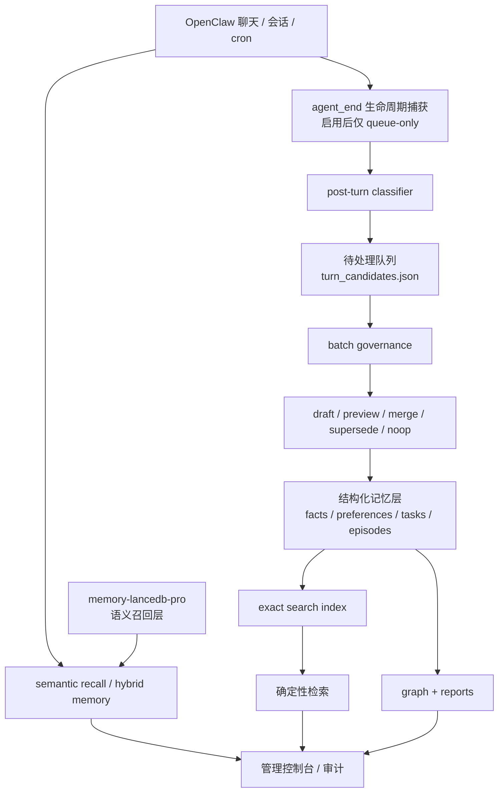

# Claw Memory System

[English](README.md) | 简体中文

本项目是一个面向 OpenClaw 的本地优先混合记忆系统。

## v0.1 自动记忆运行时亮点
- 结构化层：facts / preferences / tasks / episodes
- pending turn queue：`turn_candidates.json`
- post-turn classifier（规则型）
- queue-only autonomous lifecycle wiring（默认关闭）
- batch governance（可自动吸收 safe drafts）
- dedupe / merge / supersede / noop
- fresh workspace smoke 已通过

## 一眼看懂架构


## 功能总览
| 功能 | 作用 | 默认状态 | 依赖 | 当前状态 |
|---|---|---:|---|---|
| 结构化记忆层 | 保存 facts / preferences / tasks / episodes | 开 | 无 | 已完成 |
| 待处理 turn 队列 | 安全缓冲新候选，不直接污染正式层 | 开 | 无 | 已完成 |
| queue-only 生命周期捕获 | 自动捕获 turn，但默认不直写结构化层 | 关 | 无 | 已完成 |
| batch governance | 自动吸收 safe drafts，刷新 graph / report | 开 | 无 | 已完成 |
| exact search | 提供确定性检索能力 | 可选构建 | 无 | 已完成 |
| semantic recall | 提供跨问法的高质量语义召回 | 外部配套 | `memory-lancedb-pro` | 推荐依赖 |
| dedupe / noop / merge | 防止重复入队、重复写入、噪音更新 | 开 | 无 | 已完成 |
| fresh workspace smoke | 验证 bootstrap → queue → governance 全链路 | 手动/CI | 无 | 已完成 |

## 默认安全策略
- `autoTurnCapture = false`
- `autoTurnQueueOnly = true`
- `turnCaptureMinConfidence = 0.88`
- `batchGovernanceEnabled = true`
- `batchGovernanceEvery = 6h`

默认原则：
> 先入队，再治理，再吸收。

不会默认直接把每轮对话写进正式结构化层。

## 完整功能的必要依赖
如果要获得完整语义召回能力，**必须同时安装并启用 `memory-lancedb-pro`**。

推荐测试组合（`v0.1.1`）：
- `openclaw >= 2026.3.12`
- `claw-memory-system = 0.1.1`
- `memory-lancedb-pro >= 1.1.0-beta.8`

推荐安装方式：
```bash
openclaw plugins install memory-lancedb-pro
openclaw plugins enable memory-lancedb-pro
```

如果当前环境的默认插件源里没有 `memory-lancedb-pro`，则应改用该插件的仓库地址安装后再启用：

```bash
openclaw plugins install https://github.com/CortexReach/memory-lancedb-pro
openclaw plugins enable memory-lancedb-pro
```

如果新环境里只有 `claw-memory-system`，没有 `memory-lancedb-pro`，本项目仍可提供：
- structured memory
- pending queue
- batch governance
- exact search

但**语义召回能力会明显下降**，整体效果会打折。

## Quickstart
### 最小可用路径
1. 先安装并启用 `memory-lancedb-pro`
2. 再安装并启用本插件
3. 如果当前 OpenClaw 环境使用显式 allowlist，请把两个插件都加入 `plugins.allow`
4. 运行 bootstrap
5. 启用或保留 batch governance 定时任务

### 推荐命令
```bash
openclaw plugins install memory-lancedb-pro
openclaw plugins enable memory-lancedb-pro
openclaw plugins install <claw-memory-system-github-url>
openclaw plugins enable claw-memory-system
```

然后执行：
```text
Call claw_memory_bootstrap
```

## 推荐使用流程
1. 先安装并启用 `memory-lancedb-pro`
2. 再安装并启用本插件
3. 如果当前 OpenClaw 环境使用显式 allowlist，请把两个插件都加入 `plugins.allow`
4. 运行 bootstrap
5. 构建 exact index（可选）
6. 启用 batch governance 定时任务
7. 如需生命周期自动捕获，再显式打开 `autoTurnCapture`

推荐 allowlist 示例：
```json
{
  "plugins": {
    "allow": [
      "memory-lancedb-pro",
      "claw-memory-system"
    ]
  }
}
```

## 关键文档
- `docs/quickstart-openclaw-chat-install.zh-CN.md`
- `docs/full-enable-guide.zh-CN.md`
- `docs/autonomous-memory-runtime.zh-CN.md`
- `docs/release-notes-v0.1.zh-CN.md`
- `docs/final-release-matrix.zh-CN.md`
- `docs/portable-release-checklist.zh-CN.md`
- `docs/lifecycle-integration-notes.zh-CN.md`

历史过程性方案文档已归档到 `docs/archive/plans/`，避免干扰首次接触本项目的人。
